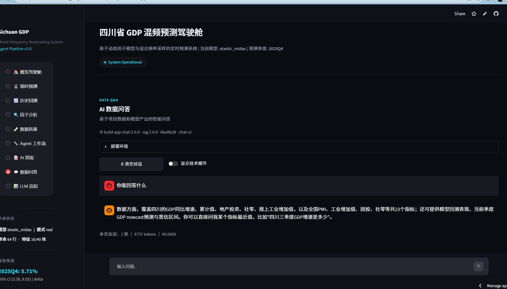
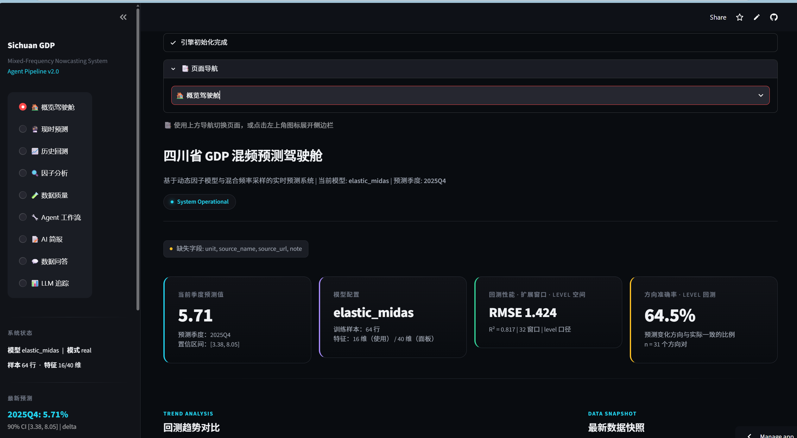
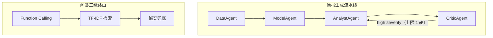

# 四川宏观经济 Nowcast 智能体系统

四川省 GDP 混频现时预测 · 多智能体自动化简报

*Multi-Agent 编排 · Function Calling · RAG 检索 · Prompt 版本化 · 模型效果评估与 bad case 分析 · MIDAS 混频回归*

输入月度高频指标，输出季度 GDP 累计同比增速点预测与置信区间。Agent 侧调用大模型 API 完成分析判断、简报生成与自动审查驳回重写。

> **定位说明**：本项目为学术竞赛与个人实践产物，运行于开发环境，
> 未做生产级部署。已知局限见 [docs/known_limitations.md](macro_nowcasting/sc_macro_agent_project/docs/known_limitations.md)。

## 在线体验

- 演示地址：https://macronowcasting-z5yheoslrhsxzwcqzvoeqe.streamlit.app/
- 首次访问冷启动约需 30 秒





## 核心工作

系统整体分为简报生成流水线与问答三级路由两条链路。



### Agent 编排

Data→Model→Analyst→Critic 四角色流水线，由 `AgentOrchestrator` 按序调度
（`sc_macro_agent/agents/orchestrator.py`）。Critic 按时间一致性 / 数字-语境匹配 /
逻辑自洽 / 越权表述 / 不确定性披露五维审查
（`sc_macro_agent/prompts/critic_review.yaml`），仅 high severity 触发 Analyst 重写，
轮次上限 1 轮（`sc_macro_agent/agents/orchestrator.py` 中 `MAX_REWRITES=1`）。
LLM 输出经三级降级提取（直接解析→剥离代码围栏→括号配对扫描）+ pydantic 宽松校验，
保证审查环节永不抛异常（`sc_macro_agent/agents/critic_agent.py`、
`sc_macro_agent/agents/schemas.py`）。

### 效果评估

两套各 20 条回归样例：检索集（`tests/rag_cases/`，TF-IDF 确定性复跑，无需 LLM）
与审查集（`tests/critic_cases/`，真实 LLM 调用）。评测入口分别为
`eval/run_rag_regression.py` 与 `eval/run_critic_regression.py`。
检索集通过 17/20，审查集通过 16/20
（`eval/badcases.md`）。bad case 归因定位 4 条 Critic 误判的共同根因为
输入舍入与时间语义口径不一致，如实记录，未为提分改判定标准
（`eval/badcases.md`；对应 `docs/known_limitations.md` #15、#16）。

### 工具调用

三级路由：4 个只读 function calling 工具（query_indicator / list_indicators /
get_model_leaderboard / get_prediction，`sc_macro_agent/tools.py`）→
TF-IDF 分池文本检索 → 诚实兜底（`sc_macro_agent/rag_service.py`），可直接取数的问题不进生成环节。
工具循环设 2 轮上限与 90s 超时截止（`sc_macro_agent/rag_service.py`、
`sc_macro_agent/llm/client.py`）。多轮历史精简：保留最近 6 条、单条截断 500 字，
控制上下文膨胀（`sc_macro_agent/rag_service.py` `_compact_history()`）。

### Prompt 工程与稳定性

提示词 YAML 外置版本化，`critic_review` 从 1.0.0 迭代至 1.3.0，
每次变更依据调用 trace 实测而非经验调参——如 `finish_reason=length` 定位截断并
上调 `default_max_tokens` 消除重试（`sc_macro_agent/prompts/critic_review.yaml` changelog；
`sc_macro_agent/prompts/registry.py`）。LLM 客户端连续 5 次失败熔断降级 mock、
60s 冷却后自动尝试恢复（`sc_macro_agent/llm/client.py`）。
单次调用 trace 落盘 JSONL，供事后归因（`sc_macro_agent/llm/client.py` `_write_trace()`）。

## 快速开始

```bash
git clone https://github.com/Liukrin/macro_nowcasting.git
cd macro_nowcasting
pip install -r requirements.txt
streamlit run macro_nowcasting/sc_macro_agent_project/app.py
```

需在 `.env` 或 Streamlit Secrets 中配置 `DEEPSEEK_API_KEY`。
未配置时 LLM 相关功能自动降级为 mock，主预测流程不受影响。

可选依赖（时序基础模型残差修正）：`pip install -r requirements-optional.txt`

## 数据

全部来自国家统计局与四川省统计局公开发布，无随机生成数据。

| 数据集 | 区间 | 规模 |
|---|---|---|
| 季度 GDP 目标变量 | 2010Q1–2025Q4 | 64 季度 |
| 四川月度指标 | 2010-02–2025-12 | 3 个指标 |
| 全国月度指标 | 2010-01–2025-12 | 18 个指标 |
| PMI 分项 | 2015-01–2025-12 | 14 个分项 |

2025Q4 GDP 为估算值；全国月度指标截止 2025-09，其后存在发布滞后缺口。
数据溯源见 [docs/data_lineage.md](macro_nowcasting/sc_macro_agent_project/docs/data_lineage.md)。

## 方法

- **特征工程**：月度→季度聚合（mean/last/std/trend/delta 等）、PCA 因子降维
- **发布时滞**：feature_vintage 三模式（full_quarter / two_month / one_month），默认 two_month
- **MIDAS 回归**：RidgeCV / ElasticNetCV 正则化；Exponential Almon Lag 权重函数，对 θ 施加 L2 收缩以适应 64 季度小样本
- **残差修正**：Chronos-Bolt 时序基础模型（可选依赖，缺失时自动降级置零）
- **评测**：expanding-window 回测，初始训练 24 季度，32 个测试窗口；基线含 last_value / seasonal_naive / arima

权重函数公式与完整推导见 [docs/methodology.md](macro_nowcasting/sc_macro_agent_project/docs/methodology.md)。

## 结果

默认 feature_vintage=two_month，模型选择器实际选中 ridge_midas（level 空间 32 窗口回测 RMSE=3.210）。
以下为固定 elastic_midas 的三模式对照（隔离 vintage 效应），level 空间、32 窗口：

<details>
<summary>展开完整回测对照表（含三种 vintage 与三个基线）</summary>

| 配置（elastic_midas 固定） | RMSE | MAE | R² | 方向准确率 |
|---|---|---|---|---|
| full_quarter（当季 3 个月，泄漏上界） | 3.139 | 1.588 | 0.112 | 0.613 |
| two_month（前 2 个月，默认） | 3.115 | 1.574 | 0.126 | 0.548 |
| one_month（仅第 1 个月） | 2.989 | 1.455 | 0.195 | 0.548 |
| last_value（基线） | 4.609 | 2.175 | -0.914 | 0.581 |
| seasonal_naive（基线） | 4.586 | 2.800 | -0.895 | 0.581 |
| arima（基线） | 3.357 | 1.916 | -0.015 | 0.548 |

</details>

**结论**：三模式下 elastic_midas 的点预测精度均优于所有基线，且是唯一 R² 为正的模型。
vintage 影响方向与「泄漏假设」相反——可用月数越少、RMSE 越低（3.139→3.115→2.989），
但 Diebold-Mariano 检验（含小样本修正）未能拒绝三模式两两「预测精度相同」的原假设
（平方误差 p 均 ≥ 0.12），故不足以断言后两个月的信息为噪声。
这是诚实信息集下的真实表现，未调任何超参。完整对比与 DM 检验表见
[docs/vintage_comparison.md](macro_nowcasting/sc_macro_agent_project/docs/vintage_comparison.md)。

> **口径说明**：上表为 level 空间回测 RMSE（单位百分点）。模型选择器按 delta 空间
> 验证集 RMSE 排序，与 level 空间回测不可直接比较（该错位见下文「已知局限」）。

## 已知局限

**模型选择器标准错位**——选择标准（delta 空间验证集 RMSE）与评估标准（level 空间回测）
不一致，默认选出的 ridge_midas（3.210）劣于被淘汰的 elastic_midas（3.115），
当前影响默认输出，仅登记未修复。

**Critic 审阅口径缺陷**——4 条「应通过」的干净用例被误判，根因为 `pred_value` 舍入
（5.37→5.4%）与 nowcast 时间语义口径不一致，如实记录为已知局限 #15、#16。

**TF-IDF 词汇匹配局限**——纯词汇匹配无法跨越语义等价（如「生产」→「规模以上工业增加值」），
语义检索可解但本地嵌入权重不完整，暂未部署（已知局限 #11）。

**样本量限制**——回测窗口 24–32，统计检验（DM）功效有限，
小样本下即使真实预测能力存在也可能无法通过显著性检验（已知局限 #5）。

完整 16 条清单见 [docs/known_limitations.md](macro_nowcasting/sc_macro_agent_project/docs/known_limitations.md)。

## 项目结构

```
sc_macro_agent_project/
├── app.py / main.py / run.py          # Streamlit / FastAPI / CLI 三个入口
├── requirements.txt                   # -r 指针 → 仓库根 requirements.txt
├── sc_macro_agent/                    # 核心包
│   ├── config.py                      # 分层配置（含 feature_vintage）
│   ├── prediction_engine.py           # 统一预测引擎（编排层）
│   ├── rag_service.py / tools.py      # RAG 问答 + function calling
│   ├── chronos_adapter.py / tslm_adapter.py  # 时序模型适配
│   ├── data/  features/  models/      # 数据 / 特征 / 建模
│   ├── agents/  llm/  prompts/        # 多智能体 / LLM 客户端 / 提示词
│   └── api/                           # 服务层 / 调度 / 上报
├── data/                              # 真实数据（CSV / Excel）
├── docs/                              # methodology / data_lineage / known_limitations / vintage_comparison
├── scripts/                           # 诊断 / 评测 / ETL 脚本
├── eval/                              # 评测入口（run_critic_regression.py / run_rag_regression.py）
├── tests/                             # 单元测试 + JSON 夹具（critic_cases / rag_cases 各 20 条）
└── assets/                            # 静态参考（chronos_reference.json）
```
